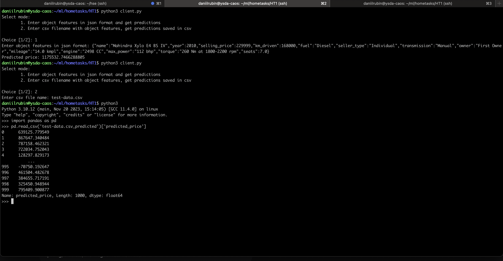

### Домашнее задание 1

#### Что сделано
1. проведен EDA и начальная обработка данных, заполнены пропуски, столбец torque разделен на два
2. обучена стандартная модель линейной регрессии только на целочисленных признаках
3. нормализованы признаки, обучена модель с Lasso-регуляризацией
4. методом грид-серча найдены оптимальные параметры для Lasso-регуляризации, сделаны выводы о том какие признаки могут быть зависимы между собой
5. методом грид-серча найдены оптимальные параметры для ElasticNet-регуляризации
6. методом one hot encoding закодированы категориальные признаки, обучена Ridge-регрессия на получившихся данных
7. реализована бизнес-метрика
8. реализован сервис на FastApi с использованием Pydantic для валидации, со следующей структурой:
    1. service/ -- файлы сервиса: 
        * client.py (клиент)
        * server.py (сервер) 
        * transforms.py (вспомогательная библиотека для преобразования данных)
    2. pickles/ -- файлы сериализованных python-объектов:
        * regr.py -- регрессор 
        * scaler.pkl -- скейлер
        * medians.pkl -- данныe о медианных значения на тестовой выборке
9. Проведено тестирование сервиса 

#### Результаты
Основной прирост в качестве итоговых моделей дали два использованных решения:

1. Разделение признака "torque" на два различных дало прирост в 1% по метрике r2 по сравнению с моделью обученной без этого признака.
2.   Использование one-hot-encoding для категориальных признаков дало прирост в 6% относительно моделей обученных только на вещественных признаках. 